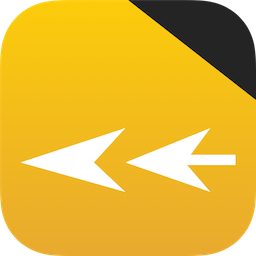
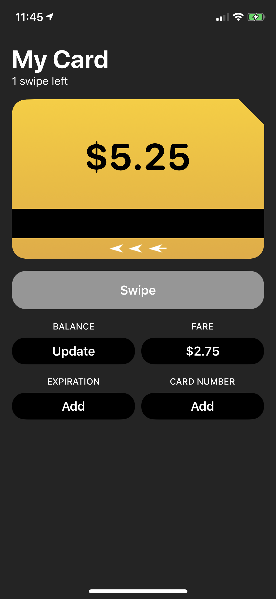

# MetroBuddy

MetroBuddy is an iOS app that allows you to track the balance of your transit card, with a primary focus on New York's MetroCard. As a New Yorker (even though 2020 is not exactly the year of subway-riding), seeing this message is rather frustrating...


I built MetroBuddy to alleviate this pain, and improve my SwiftUI and app architecting skills.

## Core Principles

- The app must not get in the way of the user's commute
    - No onboarding/account required
    - No cellular connection required
    - Fast and straightforward interactions
- Turnstiles aren't always accessible, so the app must be
    - Property tag views for accessibility 
    - Design with Dynamic Type and color contrast in mind
    - Keep design simple

## Interface Design

These are the main screens of the app:

| Onboarding | Idle State | Expiration Date Picker |
|---|---|---|
|  |  |  |

### Information Structure
The information is structured in a way that satisfies both of the core principles: obvious and accessible. The linear data layout works well with screen readers. The use of a larger font for the balance makes it easier for riders to know if they need to reload their MetroCard before swiping while they are running down the station's stairs.

### Metaphors
As a public transit enthusiast, swiping my MetroCard to enter the subway brings me joy. I wanted to replicate this enthusiasm in the app by making it playful and "obviously metro". 
- The card's balance is displayed inside a view that resembles a MetroCard
- You can swipe the card to the left to record one swipe
- When the balance is insufficient to record a swipe, a toast with a monospaced font appears to display the same message as the turnstile


### Colors
Since the app will most likely be used just before or right after the user enters the subway, a dark design felt like a natural decision to better accomodates the subway's minimally lit environment.

## Architecture Overview

- The `MetroKit` framework contains the core building blocks of the app:
    - The app's Core Data models
    - The `MetroCardDataStore` protocol that exposes Combine publishers for getting and updating the card
    - The `UserPreferences` protocol that provides a type-safe wrapper around UserDefaults
    - Helpers to load and configure persistent containers
- The main `App` target
    - Uses the `MVVM` pattern: 
        - `ObservableObject` view models get the data from `MetroKit`, compute the contents of the view and publish them
        - SwiftUI views subscribe to their view model through `EnvironmentObject` and forwards them the user's input 
    - Organized by screens (root/error/main) which each have their own components
    - Defines shared components to be reused by multiple views and helpers
    
The app's Core Data setup is heavily inspired by [CareKit's](https://github.com/carekit-apple/CareKit) approach. Consumers of the data makes requests and submits updates through a single store, which returns static snapshots in the form of a `struct` based on the data of the managed object.

To facilitate accessing the data of this snapshot, we wrap it inside an `ObjectReference` object, which contains the managed object's identifier that can only be used internally by `MetroKit` without being exposed to consumers of the store. Members of the snapshot are accessible directly from the
object reference, through a dynamic member lookup subscript. For example, these two calls are equivalent:

```swift
let card: ObjectReference<MetroCard> = ... // get the card from the store
card.snapshot.balance == card.balance // true
```

## Tests

This is the overview of the state of testing:
- `MetroKit` stores and models are unit-tested
- [ ] The app's view models should be unit-tested
- [ ] The app's core flows should be UI-tested
- [ ] The app should be tested and deployed continously

## Contributing

Contributions, feedback and suggestions are more than welcome! Please read the [Contribution Guidelines](CONTRIBUTING.md) and [License](LICENSE.md) before. While I am mostly looking for help in the following areas, all contributions are welcome and appreciated:

- Documentation improvements
- Accessibility issues
- Design review
- App Architecture feedback

## License

The source code and documentation are [licensed](LICENSE) under the MIT license. Source code is defined as compilable text files (ending in `.swift`, `.plist`, `.xcdatamodel`, `.xcodeproj`). However, designs, flows and assets are copyrighted and may not be redistributed without permission. You are not permitted to redistribute copies the application on the App Store. 

Please note that the app is not affiliated with New York's MTA in any way.

### Third-Party Licenses
The app uses the following third party library:
- [CombineExt](https://github.com/CombineCommunity/CombineExt)
